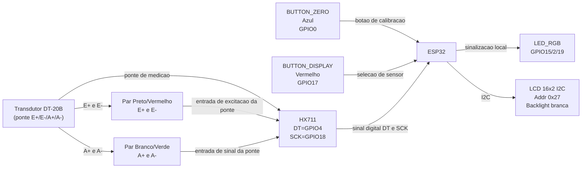

# S5 - DT-20B (Deslocamento em mm)

Este documento consolida a migracao do S5 de peso (kg) para deslocamento (mm) e descreve os perifericos fisicos do prototipo para leitura tecnica e executiva.

## Visao executiva

- Sensor principal atual: transdutor linear DT-20B (0-20 mm).
- Unidade principal do sistema: `mm` (LCD, serial e dashboard Ibirapitanga).
- Botao azul: calibracao de zero e span.
- Botao vermelho: selecao de sensor no clique curto; LCD on/off no clique longo.
- Indicacao local: LED RGB por faixas de deslocamento.
- Display local: LCD 16x2 via I2C.
- Pares de fios preto/vermelho e branco/verde: ponte de medicao entre DT-20B e HX711.

## Perifericos da placa (fisico + firmware)

| Periferico | Cor fisica | Funcao operacional | GPIO/Interface | Conector/ligacao | Estado atual | Observacoes |
| --- | --- | --- | --- | --- | --- | --- |
| `BUTTON_ZERO` | Azul | Calibracao: toque curto = `raw_zero`; segurar 3s e soltar = `raw_at_20mm` | `GPIO0` | Entrada digital de botao no ESP32 | Funcao confirmada em firmware, cor confirmada | Posicao/etiqueta fisica: `PENDENTE DE VALIDACAO`; tipo do botao: `PENDENTE` |
| `BUTTON_DISPLAY` | Vermelho | Clique curto: percorre sensores; clique longo: liga/desliga LCD | `GPIO17` | Entrada digital de botao no ESP32 | Funcao confirmada em firmware, cor confirmada | Nao documentar como reset logico |
| `LED_RGB` | `PENDENTE DE VALIDACAO` | Indicacao de estado (normal/aviso/critico) | `GPIO15` (R), `GPIO2` (G), `GPIO19` (B) | Saidas digitais para LED RGB | GPIOs confirmados em firmware | Mapeamento canal-cor final depende da montagem fisica |
| `LCD` | Backlight branca | Exibicao local de deslocamento, temperatura e umidade | I2C (`0x27`) | Barramento I2C no ESP32 | Interface confirmada em firmware | Modelo fisico exato: `PENDENTE DE VALIDACAO` |
| `HX711` | `PENDENTE DE VALIDACAO` | Conversao da ponte de medicao para leitura digital | `DT=GPIO4`, `SCK=GPIO18` | Ponte E+/E-/A+/A- | Interface confirmada em firmware | Caminho de sinal mantido na migracao para mm |
| Par `E+/E-` do transdutor | Preto e vermelho | Excitacao da ponte de medicao entre DT-20B e HX711 | Entrada analogica de ponte no HX711 | DT-20B `<->` HX711 | Cor e funcao confirmadas | Nao representa alimentacao geral da placa |
| Par `A+/A-` do transdutor | Branco e verde | Sinal diferencial da ponte de medicao entre DT-20B e HX711 | Entrada analogica de ponte no HX711 | DT-20B `<->` HX711 | Cor e funcao confirmadas | Mapa exato por borne/pino fisico: `PENDENTE DE VALIDACAO` |

## Diagrama textual (Mermaid)

## Legenda de cores e convencoes

- Azul: botao de calibracao (`BUTTON_ZERO`).
- Vermelho: botao de selecao de sensor (`BUTTON_DISPLAY`), com clique longo para LCD on/off.
- Preto/Vermelho: par `E+/E-` da ponte de medicao DT-20B `<->` HX711.
- Branco/Verde: par `A+/A-` da ponte de medicao DT-20B `<->` HX711.
- Itens marcados como `PENDENTE DE VALIDACAO` precisam confirmacao visual final na bancada.

## Como o codigo funciona agora

- O firmware possui modo multi-sensor V1 com dois perfis: `DT-20B (mm)` e `celula de carga (kg)`.
- O botao vermelho alterna o sensor ativo e salva a selecao em memoria nao volatil (NVS).
- O botao azul calibra o sensor ativo:
  - DT-20B: zero (curto) e span 20 mm (longo).
  - Celula de carga: tara (zero).
- O firmware le o valor bruto (`raw`) do HX711 e converte conforme o perfil ativo.

Formula:

`mm = (raw - raw_zero) * 20.0 / (raw_at_20mm - raw_zero)`

## O que foi modificado na migracao

1. Removido o modelo de balanca (peso em `kg`) para o sinal principal.
2. Adotada logica de deslocamento (`LinearDisplacementSensor`) em `mm`.
3. Botao ZERO passou a operar calibracao de dois pontos em campo.
4. Saidas de tela e serial atualizadas para `mm`.
5. Telemetria principal migrada para MQTT oficial da Ibirapitanga com `displacement_mm` ou `weight_kg` conforme o sensor ativo.
6. Limiares de LED adaptados para faixa de deslocamento.
7. `microSD.ino` movido para `src/prototipo/s5/experimentos/` para evitar conflito de compilacao.

## Calibracao em campo (botao ZERO - GPIO0)

- Toque curto: grava referencia de 0 mm (`raw_zero`) na posicao atual.
- Segurar por 3 segundos: entra em modo de calibracao de span de 20 mm.
- Soltar o botao: grava referencia de 20 mm (`raw_at_20mm`) na posicao atual.

Constantes usadas:

- `RAW_ZERO_DEFAULT`: leitura bruta inicial para 0 mm.
- `RAW_AT_20MM_DEFAULT`: leitura bruta inicial para 20 mm.

## Telemetria

- Broker MQTT oficial: `mqtt-protocol-ibirahml.linux.ipt.br:1883`
- Topico do device oficial: `/v1/devices/0877945a-e3fe-46ea-bdf1-0105ac35d8e8/telemetry`
- Payload principal: `sensor_type_id`, `sensor_label`, `value`, `unit`
- Campos dedicados por sensor: `displacement_mm` ou `weight_kg`
- Variaveis adicionais: `temperature`, `humidity`

## Limiares de alerta (LED)

- Normal: `< 15 mm`
- Aviso: `>= 15 mm` e `< 20 mm`
- Critico: `>= 20 mm`

## Validacao em bancada

1. Posicionar sensor em referencia mecanica e executar toque curto (zero).
2. Confirmar leitura proxima de 0 mm no serial/LCD.
3. Aplicar deslocamento conhecido e conferir leitura em mm.
4. Para span, segurar ZERO por 3s, ajustar para referencia de 20 mm e soltar para gravar.
5. Verificar publicacao MQTT no device oficial da Ibirapitanga e atualizacao em `/dashboards`.
6. Verificar transicao de LED em normal/aviso/critico.

## Pendencias de identificacao fisica

1. Posicao/etiqueta fisica exata dos dois botoes na placa final.
2. Tipo fisico de cada botao (momentaneo, trava, etc.).
3. Tipo fisico do LED RGB e mapeamento final cor x canal na montagem.
4. Modelo fisico final do LCD (fabricante/modulo I2C).
5. Mapa final de conectores por posicao fisica (ex.: J1/J2/bornes).
